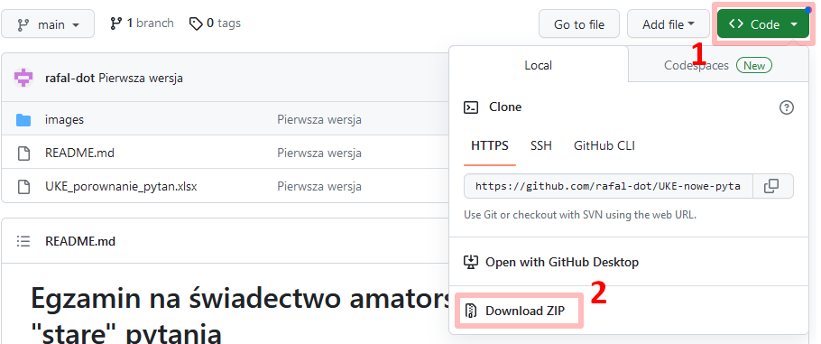

# Egzamin na świadectwo amatorskie UKE: "nowe" a "stare" pytania

W ciągu ostatnich kilku miesięcy (kwiecień 2023) pojawiła się "nowa" baza pytań
na egzamin w UKE na amatorskie świadectwa operatora urządzeń radiowych.
Niniejsza strona powstała po to, aby ułatwić identyfikację wiedzy, którą należy
pogłębić, aby dobrze samodzielnie przygotować się do egzaminu.

# WPROWADZENIE

W ostatnim czasie pojawiła się przygotowana przez Krakowski Kurs Krótkofalarski
propozycja
["nowych" pytań](https://hackerspacekrk.github.io/pytania-egzaminacyjne/) na
egzaminy na świadectwa klas A i C operatora urządzeń radiowych w służbie
radiokomunikacyjnej amatorskiej przeprowadzanym przez Urząd Komunikacji
Elektronicznej (UKE).

"Stare" pytania składają się z ponad 400 pozycji. Stworzono do nich sporo
materiałów pomocniczych oraz gotowe zestawy z odpowiedziami (patrz sekcja z
przydatnymi łączami pod koniec pliku). Znacznie ułatwia to samodzielną naukę.

Baza "nowych" pytań składa się z ponad 500 pozycji. Łatwo zauważyć, że sporą
jej część stanowią pytania występujące już w "starym" zbiorze, ewentualnie z
nieznacznie zmodyfikowaną treścią. Część pozycji usunięto. Biorąc pod uwagę
postęp technologiczny oraz mało nowoczesne podejście do niektórych zagadnień w
"starym" zbiorze, zmiany te wydają się jak najbardziej zasadne. Jednak ich
identyfikacja w tak dużym zbiorze jest dość utrudniona.

Wobec braku materiałów, które pokrywałby nowe zagadnienia w stopniu podobnym do
"starej" bazy, stworzyłem niniejszy zbiór. W moim przekonaniu ułatwi to
identyfikację różnic, co ułatwia lepsze opanowanie materiału i przegotowanie
się do egzaminu.

# ZAWARTOŚĆ PLIKU `UKE_porownanie_pytan.xlsx`

Podstawowa zawartość znajduje się w pliku
[`UKE_porownanie_pytan.xlsx`](UKE_porownanie_pytan.xlsx). Zawiera on porównanie
"starych" pytań z bazy UKE z propozycją nowych pytań. Najbardziej istotną
zakładką jest `porownanie`:


W dwóch pierwszych kolumnach `A` i `B` znajdują się:
- w wypadku pytań niezmienionych lub lekko zmodyfikowanych, odpowiednie
  identyfikatory ze "starego" (kolumna `B`) i "nowego" (kolumna `A`) zbioru
  pytań,
- w wypadku pytań dodanych, w kolumnie `A` znajduje się identyfikator nowego
  pytania, zaś kolumna `B` jest pusta,
- w wypadku pytań usuniętych, kolumna `A` jest pusta, zaś w kolumnie `B`
  znajduje się identyfikator starego pytania.

Zmiany w treści pytań zostały tutaj oznaczone następująco:
- dodane treści są zaznaczone <span style="color:blue"><u>na niebiesko i
  podkreślone</u></span>, 
- treści usunięte zostały zaznaczone <span style="color:red">~~na czerwono i
  przekreślone~~</span>,
- fragmenty niezmienione są zaznaczone czarną czcionką,
- całe niezmodyfikowane komórki mają szare tło.

Ponadto w pliku są jeszcze 3 inne zakładki:
- `TITLE` - zakładka tytułowa wraz z podstawowym opisem,
- `new` - zakłądka z bazą "nowych" pytań. W pierwszej kolumnie jest
  identyfikator pytania stworzony za pomocą numeru rozdziału oraz
  identyfikatora z oryginalnego zbioru,
- `old` - zakładka z bazą "starych" pytań. W pierwszej znajduje się 
  analogiczny identifkator, jak w poprzedniej zakładce.

# JAK ŚCIĄGNĄĆ PLIK

Aby ściągnąć pliki wystarczy zrobić jedno z poniższych:

- ściągnąć skompresowane archiwum ze strony [repozytorium
  GitHub](https://github.com/rafal-dot/UKE-nowe-pytania) (patrz pola
  `Code`/`Download ZIP`):



lub

- wykonać komendę `git clone`:
```commandline
git clone https://github.com/rafal-dot/UKE-nowe-pytania.git
```

# PRZYDATNE LINKI

Niniejsze pliki można ściągnąć z [repozytorium
GitHub](https://github.com/rafal-dot/UKE-nowe-pytania)

Ponadto, poniżej znajduje się lista pomocnych linków:
- Bazy pytań:
  - Propozycja nowej bazy pytań przygotowanej przez [Krakowski Kurs
    Krótkofalarski](https://hackerspacekrk.github.io/pytania-egzaminacyjne/)
    (pytania znajdują się w zakładce `new` pliku Excel),
  - Pytania - z odpowiedziami - ze strony [Wirtualnego Egzaminu
    Krótkofalarskiego](http://www.egzaminkf.pl/infusions/test_examination/pytaniaA.php)
    (pytania znajdują się w zakładce `old` pliku Excel),
  - Alternatywny [test wiedzy](https://test.sp6dlv.pl/) przygotowany przez
    SP6DLV,
  - Pytania znajdujące się na
    [stronie UKE](https://bip.uke.gov.pl/swiadectwa-operatora-urzadzen-radiowych-tresci/swiadectwa-amatorskie,3.html),
- Kurs i książki:
  - [Krakowski Kurs Krótkofalarski](https://www.youtube.com/watch?v=Wo2Zof96vjM&list=PLziQLnE44RtWN2jaay-1BDeQ0eAkkuuJi),
  - "Poradnik ultrakrótkofalowca", Zdzisław Bieńkowski, 1988 roku.  Książka do
    ściągnięcia z wielu miejsc w formie PDF. Proponuję użyć swojej ulubionej
    wyszukiwarki,
  - "ABC Krótkofalowca", Krzysztof Słomczyński, 1988, WKŁ. Skan również do
    znalezienia w sieci,
- Inne:
  - Mój skrypt [`xlsxDiff`](https://github.com/rafal-dot/xlsxDiff/) napisany w
    Python'ie, użyty do porównania baz pytań.
